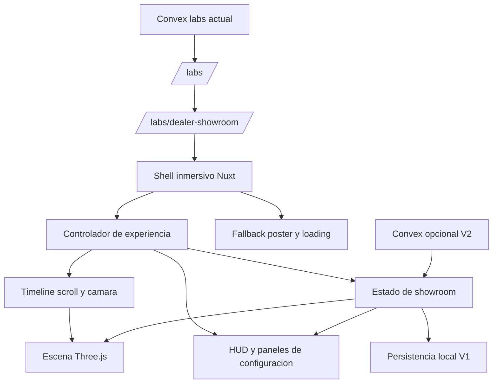
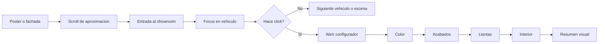

# Blueprint Arquitectonico - Labs Showroom 3D Automocion

Fecha: 25-04-2026
Proyecto: fsarmiento
Estado: Propuesta inicial para laboratorio

Documentos complementarios:

- `docs/labs-showroom-implementation-plan.md`
- `docs/labs-showroom-preproduction.md`

## 1. Resumen ejecutivo

La idea encaja bien en este repositorio, pero no como una ampliacion directa de la pagina actual de `labs`. Hoy `labs` funciona como un listado liviano de experimentos publicado desde Convex. Este nuevo concepto debe plantearse como una mini aplicacion inmersiva dentro de la ruta publica, aislada tecnica y visualmente del resto del portfolio.

La recomendacion es construir una experiencia experimental bajo una ruta dedicada, por ejemplo `/labs/dealer-showroom`, manteniendo el listado actual de `/labs` como indice de experimentos. La experiencia 3D se cargaria de forma perezosa, con runtime cliente propio, estado de configuracion encapsulado y persistencia local en la primera version. Convex quedaria fuera del camino critico inicial, salvo para registrar el experimento como entrada publicable y, mas adelante, para telemetria o presets administrables.

El objetivo no debe ser un e-commerce real ni un metaverso completo. El objetivo correcto para este laboratorio es transmitir una idea fuerte: showroom inmersivo, narrativa espacial con scroll, seleccion de vehiculo y personalizacion reactiva visible en tiempo real.

## 2. Contexto actual del proyecto

Estado observado del repo:

- La app principal esta construida con Nuxt 4 + Vue 3 + TypeScript.
- La arquitectura usa Nuxt Layers: `base`, `public` y `admin`.
- La ruta actual de `labs` es un grid simple que consume `server/api/public/labs.get.ts` y lee del modulo `convex/labs.ts`.
- Ya existe `gsap` en dependencias, lo cual reduce el coste de introducir narrativa por scroll.
- No existe aun una superficie 3D ni dependencias de `three` en el proyecto.

Conclusion: el proyecto ya tiene un buen contenedor para publicar un laboratorio nuevo, pero no tiene todavia el runtime, la canalizacion de assets ni el modelo de interaccion para una experiencia 3D avanzada.

## 3. Objetivo del laboratorio

Construir una experiencia web inmersiva de automocion con esta secuencia base:

1. Pantalla inicial con la puerta o fachada del concesionario.
2. El scroll acerca la camara en primera persona y provoca la entrada al espacio.
3. Una vez dentro, el usuario encuentra un vehiculo destacado.
4. Si continua el desplazamiento sin interactuar, avanza al siguiente vehiculo o escena.
5. Si hace click en el vehiculo, entra en modo configurador.
6. Cada scroll avanza o retrocede entre pasos de personalizacion.
7. Los cambios se reflejan al instante en el coche.
8. La configuracion se guarda automaticamente en cada seleccion.

## 4. Principios de arquitectura

### 4.1 Aislamiento fuerte

Esta experiencia debe vivir como una app independiente dentro de la app, no como una extension del listado actual.

Decisiones clave:

- Mantener `/labs` como indice simple.
- Crear una ruta dedicada para la experiencia inmersiva.
- Usar layout propio y HUD propio para no contaminar el header, espaciados y comportamiento del resto del sitio.
- Mantener el codigo 3D fuera de los componentes globales compartidos.
- Cargar el runtime 3D solo cuando el usuario entra en la experiencia.

### 4.2 Laboratorio antes que producto

El laboratorio debe demostrar vision, no cerrar todas las capas de negocio.

Por tanto, la V1 no debe incluir:

- checkout
- autenticacion de cliente
- catalogo de decenas de vehiculos
- pricing real
- stock real
- comparador completo
- experiencia multiusuario
- IA generativa real

### 4.3 Calidad visual con alcance controlado

El impacto debe venir de:

- una transicion de entrada muy bien resuelta
- un solo entorno fuerte
- uno o dos vehiculos bien curados
- un configurador breve pero reactivo
- una direccion de arte consistente

No debe venir de intentar simular todo un concesionario enterprise.

## 5. Recomendacion de planteamiento dentro del repo

## 5.1 Ruta propuesta

- `/labs` -> listado actual de laboratorios
- `/labs/dealer-showroom` -> experiencia inmersiva 3D

Esto permite que el resto del portfolio siga intacto y que el nuevo laboratorio tenga su propio ciclo de carga, su propia UX y sus propios assets.

## 5.2 Estrategia de render

Recomendacion para este laboratorio:

- Mantener la app general en SSR como esta hoy.
- Tratar la ruta del showroom como experiencia cliente-heavy.
- Renderizar un shell minimo y un poster/fallback accesible.
- Montar el canvas 3D solo en cliente.

Dos opciones validas:

### Opcion A - Preferida para el laboratorio

Ruta del showroom con comportamiento practico de mini SPA:

- experiencia muy aislada
- menos riesgo de hydration mismatch
- menos acoplamiento con SSR
- peor SEO, pero aceptable para un laboratorio

### Opcion B - Hibrida

SSR del contenedor y overlays, con `ClientOnly` para el canvas.

- mejor integracion con Nuxt
- mejor fallback accesible
- algo mas de complejidad en hidratacion

Mi recomendacion: empezar con la opcion B si quieres mantener coherencia con el portfolio y pasar a A solo si la escena exige aislamiento total del runtime.

## 5.3 Stack tecnico recomendado

| Pieza                | Recomendacion                                  | Motivo                                                                            |
| -------------------- | ---------------------------------------------- | --------------------------------------------------------------------------------- |
| Framework host       | Nuxt 4 actual                                  | Ya existe y ya estructura `labs`                                                  |
| UI host              | Vue 3 + script setup                           | Integracion natural con el resto del repo                                         |
| Motor 3D             | Three.js                                       | Control total de escena, camara, materiales y assets                              |
| Narrativa por scroll | GSAP + ScrollTrigger                           | Ya existe GSAP en el proyecto y encaja muy bien para timeline de camara y paneles |
| Estado local         | composables + store local simple               | Suficiente para V1, sin introducir complejidad innecesaria                        |
| Persistencia V1      | localStorage/sessionStorage                    | Guarda elecciones sin tocar backend critico                                       |
| Persistencia V2      | Convex                                         | Solo si luego quieres presets, analitica o control admin                          |
| Assets 3D            | GLB optimizado + Draco/Meshopt + texturas KTX2 | Reduce peso y tiempo de carga                                                     |
| Audio                | Opcional y muy contenido                       | Puede elevar la experiencia, pero no es imprescindible en V1                      |

Nota importante: aunque el usuario hable de Three.js, la decision de usar una capa Vue sobre Three.js puede reabrirse despues. Para esta V1, la prioridad es controlar bien scroll, camara y cambio de materiales. Si eso obliga a trabajar mas cerca del core de Three.js, es una decision razonable.

## 6. Arquitectura propuesta



## 7. Separacion por capas y carpetas

Propuesta compatible con la arquitectura actual y con una evolucion futura hacia FSD:

```text
layers/public/
  app/
    pages/
      labs.vue
      labs/
        dealer-showroom.vue
    components/
      labs/
        showroom/
          ShowroomShell.vue
          ShowroomCanvas.client.vue
          ShowroomHud.vue
          VehicleConfiguratorPanel.vue
          VehicleStepIndicator.vue
          LoadingPoster.vue
    composables/
      useShowroomExperience.ts
      useShowroomScroll.ts
      useVehicleConfigurator.ts
      useShowroomPersistence.ts
    utils/
      labs/
        showroom/
          scene/
          materials/
          cameras/
          manifest.ts

public/
  labs/
    dealer-showroom/
      models/
      textures/
      hdr/
      posters/

convex/
  labs.ts             # sin cambios obligatorios en V1
  showroom*.ts        # solo si se activa V2
```

Regla importante: nada de esto debe entrar en `layers/base` salvo algun helper reutilizable de muy bajo nivel. El showroom no debe convertir lo global en dependiente del laboratorio.

## 8. Modelo de experiencia

## 8.1 Estados principales

La experiencia debe modelarse como una maquina de estados simple.

Estados recomendados:

- `intro`
- `approach`
- `entering`
- `vehicle-focus`
- `vehicle-browse`
- `configurator-open`
- `config-step-color`
- `config-step-trim`
- `config-step-wheels`
- `config-step-interior`
- `summary`

No hace falta meter una libreria de state machine en V1. Un controlador explicito con enums y transiciones bien definidas es suficiente.

## 8.2 Reglas de interaccion

- Scroll down: avanza en la narrativa o en el siguiente paso de configuracion.
- Scroll up: retrocede.
- Click en vehiculo: bloquea el modo browse y abre configurador.
- Click fuera o CTA explicito: vuelve al flujo narrativo.
- Cada cambio de opcion actualiza materiales, visibilidad o variantes del modelo.
- Cada cambio tambien se persiste localmente.

## 8.3 Separacion de responsabilidades

- El timeline controla progreso narrativo.
- El configurador controla seleccion de opciones.
- La escena 3D solo renderiza estado derivado.
- La persistencia no decide la experiencia; solo guarda snapshots.

## 9. Estrategia de datos

## 9.1 V1 recomendada

Usar un manifiesto local para no sobrecargar Convex demasiado pronto.

Ejemplo de datos en V1:

- lista de vehiculos disponibles
- ruta del modelo GLB
- presets de camara
- grupos de configuracion
- colores y acabados
- orden de pasos

Ventajas:

- no afecta al backend actual
- no rompe admin ni seguridad
- facilita iteracion rapida
- permite probar UX sin cerrar modelo de datos definitivo

## 9.2 V2 opcional en Convex

Solo cuando el laboratorio ya funcione y quieras editar contenido desde admin.

Tablas posibles:

- `showroomExperiences`
- `showroomVehicles`
- `showroomOptionGroups`
- `showroomOptions`
- `showroomSessions`

No recomiendo crear estas tablas en la primera iteracion.

## 10. UI/UX recomendada

## 10.1 Direccion de experiencia

Tomando como referencia la direccion de piezas como Vertex3D y Oryzo, la experiencia debe apoyarse en:

- narrativa lineal con alto control de camara
- una atmosfera clara desde el primer frame
- overlays editoriales breves, no paneles enterprise desde el inicio
- sensacion de marca premium
- una interaccion principal muy entendible

## 10.2 Flujo UX ideal



## 10.3 HUD y overlays

Mantenerlos minimos:

- logo o nombre del laboratorio
- hint de scroll
- indicador de paso
- boton de salir o volver a `labs`
- panel de configuracion contextual
- mini resumen de configuracion actual

Evitar en V1:

- menus densos
- specs tecnicas extensas
- tablas comparativas
- exceso de CTAs

## 10.4 Accesibilidad base

Aunque sea un laboratorio, no deberia romper lo esencial:

- fallback visual si WebGL no esta disponible
- modo reducido para `prefers-reduced-motion`
- navegacion por teclado para el panel de configuracion
- textos alternativos y copy estructural fuera del canvas
- CTA claro para salir de la experiencia

## 11. Presupuesto tecnico y de rendimiento

Para que esto no lastre al resto del sitio, hay que fijar limites duros.

Presupuesto recomendado para la ruta del laboratorio:

- JS inicial fuera del chunk 3D: menor de 180 KB comprimidos
- chunk 3D inicial: ideal menor de 400 KB comprimidos
- primer modelo visible: ideal entre 4 MB y 8 MB ya comprimido y optimizado
- maximo de 1 HDR principal
- maximo de 1 o 2 vehiculos reales cargados al inicio
- lazy loading del resto de variantes

Reglas operativas:

- no cargar todos los vehiculos al entrar
- no cargar todas las texturas a maxima resolucion
- no usar postprocesado pesado en V1
- no abusar de sombras dinamicas complejas
- limitar DPR en moviles
- pausar o degradar animaciones fuera de foco

## 12. Lo que no podremos crear aqui de forma realista en esta fase

Esta parte es importante para mantener el laboratorio dentro de un alcance defendible.

## 12.1 IA real de producto

No plantearia en esta fase:

- recomendador IA de vehiculos
- generacion de acabados por prompts
- copiloto conversacional del showroom
- configurador que invente versiones automaticamente
- personal shopper con modelos fundacionales externos

Motivo: eso abre otra linea de producto, otra infraestructura y otra capa de UX. Para un laboratorio, desviaria el foco de la experiencia 3D.

## 12.2 Produccion 3D completa desde el repo

Tampoco podemos resolver aqui por si solos:

- modelado profesional de coches desde cero
- rigging o animaciones de puertas/interiores complejas a nivel AAA
- texturizado PBR de calidad premium sin pipeline externo
- configurador photoreal con catalogo real de fabricante

Para transmitir la idea, necesitaremos assets curados:

- un modelo GLB de alta calidad pero optimizado
- un segundo vehiculo opcional
- materiales y variantes bien seleccionadas
- un entorno interior sencillo pero creible

## 12.3 Producto e-commerce real

No deberia entrar en esta fase:

- pago
- reserva real
- CRM
- integracion con stock de concesionario
- VIN real
- cotizador financiero
- multiusuario sincronizado

## 13. MVP recomendado

Si queremos ser ambiciosos sin romper el proyecto, este deberia ser el MVP:

### MVP V1

- una ruta nueva `/labs/dealer-showroom`
- una escena principal de concesionario o hall de entrada
- una secuencia de aproximacion por scroll
- un vehiculo principal
- un segundo vehiculo opcional solo para demostrar browse
- click para abrir configurador
- 3 o 4 pasos de personalizacion
- cambios reactivos visibles en tiempo real
- autoguardado local
- boton para reiniciar configuracion
- fallback poster para dispositivos no compatibles

### No MVP

- multiples salas
- ciudad exterior explorable
- avatar
- multiplayer
- IA
- checkout
- backend rico de configuraciones

## 14. Roadmap por slices

## Slice 0 - Preparacion tecnica

- instalar `three`
- definir politica de assets
- preparar ruta y layout del laboratorio
- montar loading poster y deteccion de soporte WebGL

## Slice 1 - Shell inmersivo

- crear pagina dedicada
- crear canvas cliente
- crear overlay de entrada
- preparar estado base de experiencia

## Slice 2 - Narrativa de scroll

- timeline de camara
- entrada al showroom
- focus al primer vehiculo
- browse entre escenas o vehiculos

## Slice 3 - Seleccion e interaccion

- picking del vehiculo
- transicion a configurador
- bloqueo temporal del flujo narrativo mientras se configura

## Slice 4 - Configurador reactivo

- color
- acabados
- llantas
- interior
- resumen visual minimo

## Slice 5 - Persistencia local

- guardar en localStorage
- restaurar configuracion previa
- reset de sesion

## Slice 6 - Pulido de laboratorio

- loading states
- reduced motion
- fallback sin WebGL
- optimizacion de assets
- telemetria minima si se considera necesaria

## 15. Mapa de implementacion compatible con FSD

Aunque el repo no esta estrictamente en FSD puro, conviene pensar el laboratorio con esa disciplina.

```text
app/
  layouts/
    immersive-lab

pages/
  labs/dealer-showroom

widgets/
  showroom-shell
  showroom-hud

features/
  showroom-scroll-navigation
  vehicle-selection
  vehicle-configuration
  showroom-session-persistence

entities/
  vehicle
  showroom-scene
  configuration-option

shared/
  lib/three
  lib/gsap
  ui/lab-overlay
```

Traduccion pragmatica al repo actual: usa esta separacion como criterio de responsabilidades, aunque los archivos vivan dentro de `layers/public/app`.

## 16. Riesgos principales y mitigaciones

| Riesgo                                    | Impacto | Mitigacion                                            |
| ----------------------------------------- | ------- | ----------------------------------------------------- |
| Querer meter demasiadas features          | Alto    | congelar alcance en un solo showroom y 1-2 coches     |
| Assets demasiado pesados                  | Alto    | GLB optimizado, texturas comprimidas, lazy load       |
| UX confusa entre scroll y click           | Alto    | tutorial inicial muy corto y estados bien delimitados |
| Integracion que afecte al resto del sitio | Alto    | ruta, layout y chunks aislados                        |
| Hidratacion o runtime inestable           | Medio   | canvas solo cliente y fallback robusto                |
| Movil con bajo rendimiento                | Alto    | calidad adaptativa, menos postproceso, menor DPR      |
| Persistencia backend prematura            | Medio   | arrancar con persistencia local                       |

## 17. ADR iniciales

## ADR-001 - El showroom vive como laboratorio independiente dentro de `labs`

Contexto:
La pagina actual de `labs` es un indice ligero. La experiencia 3D tiene necesidades de runtime, assets y UX muy distintas.

Decision:
Crear una ruta propia y tratarla como mini aplicacion inmersiva dentro del slice publico.

Consecuencias:

- Pros: aislamiento, menor riesgo sobre el portfolio, mejor control de rendimiento.
- Contras: mas codigo especifico y menos reutilizacion inmediata.

## ADR-002 - Persistencia local primero, Convex despues

Contexto:
El laboratorio necesita demostrar flujo e interaccion, no un backend editorial completo en la primera entrega.

Decision:
Guardar configuraciones en navegador durante la V1 y posponer tablas nuevas de Convex.

Consecuencias:

- Pros: velocidad de ejecucion, menos deuda de modelo de datos, menos riesgo sobre admin.
- Contras: sin sincronizacion cross-device ni gestion admin desde el primer dia.

## ADR-003 - Scroll como motor narrativo principal

Contexto:
La idea base depende de entrada cinematografica, avance espacial y pasos de configuracion ligados al desplazamiento.

Decision:
Usar scroll como input principal y click como bifurcacion al modo configurador.

Consecuencias:

- Pros: experiencia memorable y coherente con la referencia creativa.
- Contras: requiere mucho cuidado en UX, accesibilidad y rendimiento.

## ADR-004 - Un solo showroom fuerte antes que un mundo grande

Contexto:
El riesgo mayor es intentar construir un pseudo metaverso completo demasiado pronto.

Decision:
Limitar la V1 a una sola escena principal con 1-2 vehiculos y pocos pasos de configuracion.

Consecuencias:

- Pros: mas calidad visual, menos dispersion, mejor time-to-value.
- Contras: menor amplitud funcional en la demo inicial.

## 18. Recomendacion final

Si quieres que esta idea funcione dentro de este proyecto sin afectar al resto, el planteamiento correcto es:

1. usar `labs` como contenedor editorial del experimento
2. construir el showroom como mini app aislada bajo una ruta propia
3. limitar V1 a una experiencia cinematografica con un configurador breve
4. dejar fuera IA, e-commerce real y backend complejo
5. optimizar assets desde el dia uno

La ambicion es razonable si la dirigimos bien. No intentaria construir un concesionario total. Intentaria construir una escena inolvidable, un flujo de scroll impecable y un configurador corto pero convincente.

## 19. Siguiente paso recomendado

El siguiente entregable ideal no es codigo aun, sino una definicion de preproduccion con:

- lista exacta de vehiculos de V1
- lista de pasos del configurador
- inventario de assets 3D necesarios
- wireflow de las pantallas overlay
- decision final sobre persistencia local o Convex en V1

Con eso ya podemos pasar a partir el trabajo en tareas tecnicas reales.
