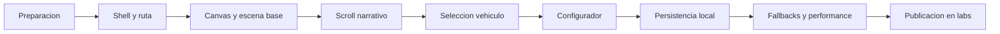

# Plan de implementacion - Labs Showroom 3D

Fecha: 25-04-2026
Proyecto: fsarmiento
Referencia base: `docs/labs-showroom-3d-blueprint.md`
Estado: plan operativo inicial

## Estado de ejecucion

Actualizado: 25-04-2026

Fase 0 iniciada y base ya implementada en el repo:

- `three` instalado en el proyecto
- ruta `/labs/dealer-showroom` creada
- shell inmersivo inicial implementado
- scaffold ligero de Three.js montado en cliente
- manifiesto local creado
- poster temporal integrado
- acceso destacado añadido en `/labs`

Progreso adicional ya ejecutado:

- narrativa base por scroll implementada
- etapas editoriales visibles en la UI
- canvas reactivo a la etapa activa y al progreso del recorrido
- configurador base conectado a color, trim y wheels sobre el scaffold
- persistencia local del configurador con restauración y reset
- fallback visual cuando WebGL no está disponible
- modo estático para `prefers-reduced-motion`
- resumen editorial del build actual dentro del panel lateral
- perfil adaptativo de calidad para proteger DPR y coste visual según dispositivo
- navegación rápida entre etapas desde el panel lateral para demo y revisión
- presets curados para cambiar la configuración del showroom en un clic
- estado visible del preset activo y pulido de accesibilidad para controles del shell
- la navegación rápida del shell ya sincroniza prefers-reduced-motion en caliente y cambia entre scroll suave y automático
- la navegación rápida alinea foco, etapa activa y grupo del configurador al usar saltos manuales
- primer GLB real integrado en `/public/labs/dealer-showroom/models/hero-ev-sport.glb`
- runtime Three.js actualizado para cargar el GLB con fallback procedural y mapear `Body`, `Glass`, `Trim` y `Wheel*`
- validación en navegador sobre el asset real: consola limpia, fuente `glb` activa y cambios de color, trim y wheels confirmados por el runtime
- asset artístico regenerado con la misma convención de nodos y HDR real `dealer-atrium-studio.hdr` integrado vía PMREM
- framing del coche separado por perfiles `compact`, `balanced` y `wide`, con validación del perfil activo desde el runtime
- estado de carga inicial dentro del canvas y primer corte de narrativa inmersiva: scroll real del documento bloqueado y avance por wheel/teclado
- shell refactorizado a un único stage fullscreen: la narrativa textual sale de la columna izquierda y pasa a overlays sincronizados por `activeStepIndex`
- el configurador, presets, navegación y resumen ya viven como dock flotante sobre la escena en lugar de depender de una composición en dos columnas
- el arranque pasa por tres fases (`booting` -> `staged` -> `interactive`): carga del runtime, entrada editorial bloqueante y liberación manual de la interacción
- la ruta anidada `/labs/dealer-showroom` ya se fuerza como viewport fijo dentro de `/labs`, cubriendo toda la pantalla aunque el layout base siga existiendo por debajo
- la lectura de estado del modo inmersivo sale casi por completo del canvas: el HUD interno se reduce al loading y los overlays del shell pasan a ser la fuente principal de narrativa y control
- los cambios de etapa dejan de ser instantáneos: la cámara arranca con el `activeStepIndex` real y los overlays/dock usan un índice presentado con retardo corto y transición dirigida (`forward`/`backward`)
- la ruta del showroom se ha separado del árbol anidado de `/labs`: `/labs` vive ahora en `pages/labs/index.vue` y `/labs/dealer-showroom` monta sin header/footer/layout base en el DOM
- se elimina la navegación rápida manual del experimento; el avance del laboratorio vuelve a depender del scroll/wheel y del teclado, con acumulación de delta para que el gesto se sienta más fluido
- el configurador deja de mostrar todos los grupos a la vez: cada escena de producto activa un único bloque contextual en el orden `Exterior color -> Wheel set -> Trim package`, manteniendo un CTA claro para volver a `/labs`
- la narrativa deja de avanzar por saltos discretos: el wheel ahora alimenta un progreso continuo con inercia ligera y el `activeStepIndex` pasa a derivarse del progreso suavizado
- la cámara ya no salta entre rigs cerrados; ahora interpola posiciones y puntos de mirada entre escenas, con un empuje más marcado en `approach` y `focus` para reforzar la sensación cinematográfica
- el dock reduce densidad durante `intro` y `approach`: presets y build sheet quedan en estado compacto hasta que la escena entra en `focus` o en los pasos de configuración
- el wheel ya distingue entre trackpad y rueda física: los gestos finos usan menor sensibilidad y más duración visual, mientras que la rueda aplica saltos de progreso más decididos con recuperación más rápida
- la interpolación de cámara ya no usa una única respuesta: `compact`, `balanced` y `wide` aplican curvas y factores de seguimiento distintos para móvil, tablet y desktop
- la duración y el desplazamiento del overlay textual ahora se modulan con la velocidad real del scroll para que los cambios lentos respiren más y los impulsos rápidos no dejen una cola visual excesiva
- la detección de entrada en `DOM_DELTA_PIXEL` ya separa `trackpad`, `magic-mouse` y `wheel` usando heurística de magnitud, fraccionalidad y cadencia en ráfagas cortas
- el cálculo de `activeStepIndex` ya no usa `round()` directa: ahora incorpora una banda de histéresis ajustable para amortiguar microoscilaciones alrededor del cruce entre escenas
- se añade un panel debug temporal visible solo en desarrollo para ajustar multiplicadores de wheel, histéresis y framing final en vivo mientras se prueba el showroom
- el último tramo del scroll deja de cerrar tanto la cámara: el framing final aplica alivio de distancia, altura y look-at para que el coche no termine más pegado ni más bajo que en el tramo hero
- el panel debug ya no aparece por defecto en todo `import.meta.dev`: solo se activa con `?showroomDebug=1` para mantener la escena limpia fuera de sesiones de calibración
- el panel incorpora presets rápidos para `Trackpad`, `Magic Mouse` y `Review mode`, además de acciones para saltar a `Hero framing` y `Final framing` sin recorrer todo el scroll
- el panel pasa a ser draggable dentro de la escena para recolocarlo mientras se inspecciona el comportamiento del runtime y del overlay
- el modo debug ahora también tiene un switch visible en desarrollo para activar o desactivar la query de depuración sin editar la URL manualmente
- los baselines de `Trackpad` y `Magic Mouse` pueden guardarse explícitamente desde el panel; si existen, pasan a ser el baseline efectivo cargado en futuras sesiones del navegador
- como la persistencia en `sessionStorage` no resultó fiable en este entorno, la posición y el estado abierto/cerrado del panel pasan a `localStorage`
- el dock del coche gana una tarjeta hero con resumen vivo de color, ruedas y trim para que la interfaz se lea más como producto configurado y menos como un panel técnico genérico

Pendiente dentro de Fase 0:

- sustituir placeholders de `model` y `hdr` por assets reales
- decidir si la ruta final conservara el comportamiento anidado bajo `labs` o si conviene un layout dedicado mas aislado en la siguiente fase

## 1. Objetivo de este documento

Traducir el blueprint arquitectonico a un plan de ejecucion realista, incremental y compatible con el repositorio actual.

Este plan esta pensado para construir una V1 de laboratorio, no un producto final de concesionario.

## 2. Definicion de done para V1

La V1 se considera terminada cuando se cumplan todas estas condiciones:

1. Existe una ruta dedicada para el laboratorio bajo `labs`.
2. La experiencia se monta sin afectar la navegacion y carga del resto del portfolio.
3. El usuario puede recorrer una secuencia de entrada con scroll.
4. El usuario puede seleccionar un vehiculo principal.
5. El usuario puede personalizar al menos 3 grupos de opciones.
6. Los cambios se reflejan visualmente en tiempo real.
7. La configuracion se guarda localmente y puede restaurarse.
8. Existe fallback sin WebGL y un camino razonable para `prefers-reduced-motion`.
9. La experiencia mantiene un presupuesto de rendimiento defendible.

## 3. Alcance bloqueado

Estas decisiones deben mantenerse cerradas durante la V1:

- 1 experiencia principal
- 1 vehiculo protagonista
- 1 vehiculo secundario opcional
- 3 o 4 pasos de configuracion
- persistencia local
- sin IA
- sin login cliente
- sin pagos
- sin catalogo real
- sin sincronizacion multiusuario

Todo lo que no entre aqui pasa a `deferred`.

## 4. Orden de ejecucion recomendado

## 5. Plan por fases

## Fase 0 - Preparacion tecnica

Objetivo:
Dejar el repo listo para recibir la experiencia sin tocar aun la interaccion compleja.

Entregables:

- dependencia `three`
- decision sobre soporte extra de loaders si hace falta
- estructura base de carpetas del laboratorio
- poster estatico temporal para la ruta
- manifiesto inicial del laboratorio

Tareas:

1. Instalar `three`.
2. Crear la ruta `layers/public/app/pages/labs/dealer-showroom.vue`.
3. Crear componentes iniciales de shell y poster.
4. Crear carpeta publica para `models`, `textures`, `hdr` y `posters`.
5. Crear un manifiesto local con el contenido minimo del experimento.

Criterio de salida:

- la ruta existe y muestra un shell estable
- no se ha roto la pagina actual de `labs`

## Fase 1 - Shell inmersivo y composicion

Objetivo:
Separar claramente el laboratorio del resto del sitio.

Entregables:

- layout o shell inmersivo
- HUD minimo
- CTA para volver a `/labs`
- zona `ClientOnly` para el canvas

Tareas:

1. Definir el layout visual del laboratorio.
2. Aislar el canvas del header global si es necesario.
3. Añadir loading state, hint de scroll y boton de salida.
4. Preparar la composicion entre shell, HUD y canvas.

Criterio de salida:

- la ruta carga de forma coherente en desktop y movil
- el usuario entiende que entra en una experiencia distinta

## Fase 2 - Escena 3D base

Objetivo:
Tener escena, camara, luces y un primer asset visible con estabilidad.

Entregables:

- escena Three.js montada en cliente
- renderer responsive
- camara principal
- entorno base del showroom
- primer vehiculo visible

Tareas:

1. Inicializar renderer, scene y camera.
2. Añadir control de resize.
3. Crear pipeline de carga para modelo GLB.
4. Configurar luces y entorno con coste controlado.
5. Exponer refs o API minima para animar camara y materiales.

Criterio de salida:

- se renderiza el showroom sin errores de consola
- el primer frame es suficientemente estable y legible

## Fase 3 - Narrativa de scroll

Objetivo:
Conectar scroll con progresion cinematografica.

Entregables:

- timeline de aproximacion
- entrada al showroom
- focus sobre vehiculo principal
- browse a segunda escena o segundo vehiculo opcional

Tareas:

1. Definir hitos de timeline.
2. Integrar GSAP + ScrollTrigger solo dentro de la ruta.
3. Sincronizar scroll y posicion de camara.
4. Bloquear transiciones ambiguas entre tramos narrativos.
5. Añadir indicadores de etapa actuales.

Criterio de salida:

- scroll down y up producen comportamiento predecible
- la narrativa se siente dirigida, no caotica

## Fase 4 - Interaccion con vehiculo

Objetivo:
Permitir pasar del modo exploracion al modo configurador.

Entregables:

- picking del vehiculo o hotspot equivalente
- cambio de estado al abrir configurador
- retorno desde configurador al flujo narrativo

Tareas:

1. Implementar deteccion de click sobre el vehiculo o hotspots.
2. Cambiar el estado global de la experiencia.
3. Desactivar temporalmente el browse narrativo durante configuracion.
4. Añadir microcopy de ayuda.

Criterio de salida:

- el usuario entiende cuando esta explorando y cuando esta configurando

## Fase 5 - Configurador reactivo

Objetivo:
Resolver el nucleo de valor del laboratorio.

Entregables:

- panel contextual
- pasos de configuracion
- cambios visuales en tiempo real
- resumen minimo de configuracion

Tareas:

1. Modelar grupos de opciones.
2. Implementar al menos `color`, `trim`, `wheels`.
3. Opcionalmente añadir `interior` si no compromete tiempo ni assets.
4. Sincronizar el panel con la escena.
5. Permitir avanzar y retroceder con scroll entre pasos.

Criterio de salida:

- el usuario puede completar el flujo sin quedarse bloqueado
- cada seleccion actualiza la escena sin latencia perceptible fuerte

## Fase 6 - Persistencia local

Objetivo:
Guardar progreso y configuracion sin crear backend nuevo.

Entregables:

- composable de persistencia
- restauracion al recargar
- boton de reset

Tareas:

1. Definir shape del snapshot.
2. Persistir de manera desacoplada del render.
3. Restaurar configuracion de forma segura.
4. Manejar versionado simple del storage.

Criterio de salida:

- una recarga restaura el ultimo estado valido
- si el storage es invalido, la experiencia vuelve al preset por defecto sin romperse

## Fase 7 - Hardening

Objetivo:
Evitar que el laboratorio penalice el proyecto o deje una experiencia fragil.

Entregables:

- fallback sin WebGL
- reduced motion
- ajustes de calidad segun dispositivo
- metricas basicas de peso y consola limpia

Tareas:

1. Detectar soporte WebGL.
2. Añadir poster o video fallback.
3. Reducir animacion cuando `prefers-reduced-motion` este activo.
4. Limitar DPR en moviles.
5. Verificar ausencia de errores de consola y bloqueos evidentes.

Criterio de salida:

- la ruta falla con dignidad cuando no puede renderizar 3D
- el resto del sitio no sufre regresiones de rendimiento obvias

## 6. Backlog de implementacion

## Must

- ruta dedicada
- shell inmersivo
- escena base
- narrativa de scroll
- configurador con 3 grupos
- persistencia local
- fallback sin WebGL

## Should

- segundo vehiculo de demostracion
- resumen final de configuracion
- transicion de salida limpia
- asset preloading controlado

## Could

- audio ambiental suave
- interior como cuarto paso
- snapshot compartible local

## Won't para V1

- IA conversacional
- login
- checkout
- cotizador
- multiusuario
- CMS de showroom en admin

## 7. Riesgos operativos

| Riesgo                                | Señal                           | Respuesta                                       |
| ------------------------------------- | ------------------------------- | ----------------------------------------------- |
| El primer asset pesa demasiado        | tiempo de carga excesivo        | recortar entorno, comprimir GLB, bajar texturas |
| El scroll se siente impreciso         | users se pierden entre estados  | simplificar timeline y reducir pasos            |
| El configurador no escala visualmente | demasiadas ramas en scene logic | limitar opciones a variantes directas           |
| Movil rinde mal                       | FPS bajos, calor, lag           | degradar calidad, bloquear efectos caros        |
| Scope creep                           | aparecen features de producto   | mover a deferred sin negociar V1                |

## 8. Deferred log inicial

Dejar fuera desde ahora:

- panel de specs tecnicas reales
- exportar configuracion a PDF
- guardar en Convex
- compartir configuracion por URL
- animaciones complejas de puertas o interior
- compra o reserva del vehiculo
- showroom multi-sala

## 9. Plan de validacion por fase

Cada fase debe validarse con una comprobacion pequeña antes de seguir:

1. Fase 0: la ruta abre sin romper build local.
2. Fase 1: shell visible y navegable.
3. Fase 2: escena renderiza sin errores.
4. Fase 3: scroll avanza y retrocede correctamente.
5. Fase 4: click entra y sale de configurador.
6. Fase 5: las opciones alteran el vehiculo en tiempo real.
7. Fase 6: recarga restaura estado.
8. Fase 7: fallback y reduced motion operativos.

## 10. Recomendacion de sesion de trabajo

Para no dispersar el desarrollo, la siguiente sesion tecnica deberia limitarse a esto:

- instalar `three`
- crear la ruta dedicada
- montar shell y poster
- dejar el manifiesto local preparado

Ese seria el primer hito defendible y el punto correcto para empezar a escribir codigo.
