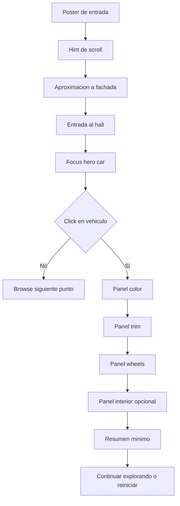

# Preproduccion - Labs Showroom 3D

Fecha: 25-04-2026
Proyecto: fsarmiento
Referencia base: `docs/labs-showroom-3d-blueprint.md`
Estado: preproduccion inicial

## 1. Objetivo de este documento

Definir lo minimo necesario antes de implementar la V1: assets, narrativa, composicion visual, interacciones y restricciones de contenido.

La funcion de este documento es evitar que la parte tecnica avance sin un marco creativo suficientemente concreto.

## 2. Concepto narrativo recomendado

Concepto de V1:

`A premium digital dealer walkthrough`.

La experiencia no debe sentirse como un configurador tradicional con menus. Debe sentirse como una secuencia cinematografica donde el usuario atraviesa un umbral, descubre un vehiculo y luego entra en un modo de personalizacion controlado.

Tono deseado:

- premium
- futurista sobrio
- tecnologico
- silencioso
- preciso

No deseado:

- sci-fi exagerado
- interfaz de videojuego arcade
- showroom recargado
- marketing gritón

## 3. Escena V1 recomendada

Una sola localizacion principal:

- fachada o acceso del concesionario
- transicion a hall interior
- zona de exhibicion central con un vehiculo hero

Escena secundaria opcional:

- una segunda plataforma o bahia con otro vehiculo

No recomendar en V1:

- ciudad exterior explorable
- multiples plantas
- transiciones entre muchas salas
- avatar caminable libre

## 4. Vehiculos V1

## Vehiculo principal

Debe cumplir:

- silueta muy reconocible
- buena lectura de materiales
- superficie suficiente para mostrar cambios de color y acabados
- asset optimizable a GLB

Roles visuales ideales:

- coupe deportivo
- berlina premium
- concept EV

## Vehiculo secundario opcional

Su funcion no es competir con el principal. Su funcion es demostrar browse y continuidad espacial.

Debe ser:

- distinto en silueta
- mas simple de materializar
- opcional para V1

## 5. Configurador V1

Grupos de opciones recomendados:

1. `Color exterior`
2. `Trim o acabado`
3. `Llantas`
4. `Interior` solo si el asset lo permite con poco coste

Numero recomendado de opciones por grupo:

- color: 4 a 6
- trim: 2 a 3
- llantas: 2 a 3
- interior: 2 a 3 maximo

Regla de preproduccion:

si una opcion no puede verse claramente durante la demo, no debe entrar en V1.

## 6. Wireflow UX



## 7. Overlay copy V1

El copy debe ser minimo y atmosferico. No comercial en exceso.

Bloques sugeridos:

- `Enter the showroom`
- `Scroll to move`
- `Select the vehicle`
- `Configure your edition`
- `Saved automatically`
- `Back to labs`

Evitar:

- claims de venta real
- precios
- textos demasiado largos
- specs tecnicas inventadas si no aportan a la demo

## 8. Sistema visual recomendado

## Paleta

Direccion recomendada:

- fondo oscuro grafito o acero
- blancos suaves para HUD
- acento metalico o ambar muy controlado
- no abusar de muchos colores de UI

## Materialidad

El protagonismo debe recaer en:

- pintura del vehiculo
- reflejos controlados
- metal cepillado o satin
- vidrio y goma con buena separacion visual

## Tipografia

Debe sentirse editorial y premium.

Evitar la sensacion de dashboard generico.

## 9. Lista minima de assets

## Assets imprescindibles

- 1 modelo GLB del vehiculo principal
- 1 entorno simple de showroom o acceso
- 1 HDR o entorno de iluminacion
- texturas base comprimidas
- 1 poster estatico para fallback

## Assets recomendados

- 1 set de llantas alternativo
- materiales alternativos del trim
- 1 segundo vehiculo opcional

## Assets no imprescindibles para V1

- audio reactivo
- video de fondo
- personajes
- crowd
- transiciones con FX complejos

## 10. Politica de optimizacion de assets

Antes de integrar cualquier asset:

1. convertir a GLB si procede
2. comprimir mallas
3. reducir texturas a lo estrictamente visible
4. validar escala y pivotes
5. nombrar nodos y materiales de forma util para scripting

Regla critica:

si el modelo llega desordenado, sin nombres consistentes o con materiales imposibles de mutar, ese asset no esta listo para entrar al repo.

## 11. Especificacion del manifiesto local

La V1 deberia tener un manifiesto local con esta informacion:

```ts
type ShowroomManifest = {
  slug: string
  title: string
  poster: string
  environment: {
    hdr: string
    sceneModel?: string
  }
  vehicles: Array<{
    id: string
    name: string
    model: string
    hero: boolean
    cameraPresets: string[]
    optionGroups: Array<{
      id: string
      label: string
      type: 'color' | 'trim' | 'wheels' | 'interior'
      options: Array<{
        id: string
        label: string
        value: string
      }>
    }>
  }>
}
```

Esto permite implementar sin depender de Convex en la primera iteracion.

## 12. Decisiones de UX que hay que cerrar antes de codear demasiado

1. El click abre panel lateral, overlay central o HUD flotante.
2. El scroll dentro del configurador mueve pasos o mueve contenido del panel.
3. El browse entre vehiculos es automatico o marcado por hitos claros.
4. El laboratorio termina en resumen o vuelve a exploracion libre.

Mi recomendacion:

- panel lateral o inferior, no modal central
- scroll mueve pasos de configuracion, no listas largas
- browse con hitos claros, no libre continuo
- cierre con resumen minimo y boton de restart

## 13. Criterios de seleccion del asset 3D

Un asset es apto para esta V1 si cumple la mayoria de estos puntos:

- GLB o convertible de forma limpia
- topologia suficientemente limpia para render web
- materiales identificables
- buena lectura en pintura y llantas
- peso razonable o reducible
- no requiere animaciones esqueleto complejas para transmitir el concepto

## 14. Dependencias externas que aun no resuelve el repo

Este repositorio puede contener y orquestar la experiencia, pero no crea por si mismo:

- un pipeline profesional de modelado 3D
- texturizado automotriz premium
- compresion automatica de assets si no se prepara aparte
- direccion de arte completa sin referencias cerradas

Por tanto, antes de construir la V1 conviene cerrar:

- asset fuente del vehiculo principal
- entorno o base del showroom
- politica de texturas
- lista exacta de materiales mutables

## 15. Checklist de preproduccion

Antes de empezar implementacion, deberian estar cerrados estos puntos:

- vehiculo principal decidido
- segundo vehiculo opcional decidido o descartado
- 3 grupos de configuracion cerrados
- copy base del HUD decidido
- poster fallback disponible
- estructura del manifiesto aprobada
- lista de materiales o nodos mutables identificada
- presupuesto de peso por asset aceptado

## 16. Recomendacion final de arranque

La forma mas segura de arrancar es:

1. elegir un solo asset hero
2. decidir exactamente 3 grupos de personalizacion visibles
3. montar primero una escena bella pero simple
4. añadir despues el scroll cinematografico
5. dejar el segundo vehiculo como mejora y no como condicion de salida

Si se respeta este orden, el laboratorio puede verse ambicioso sin volverse inmanejable.
